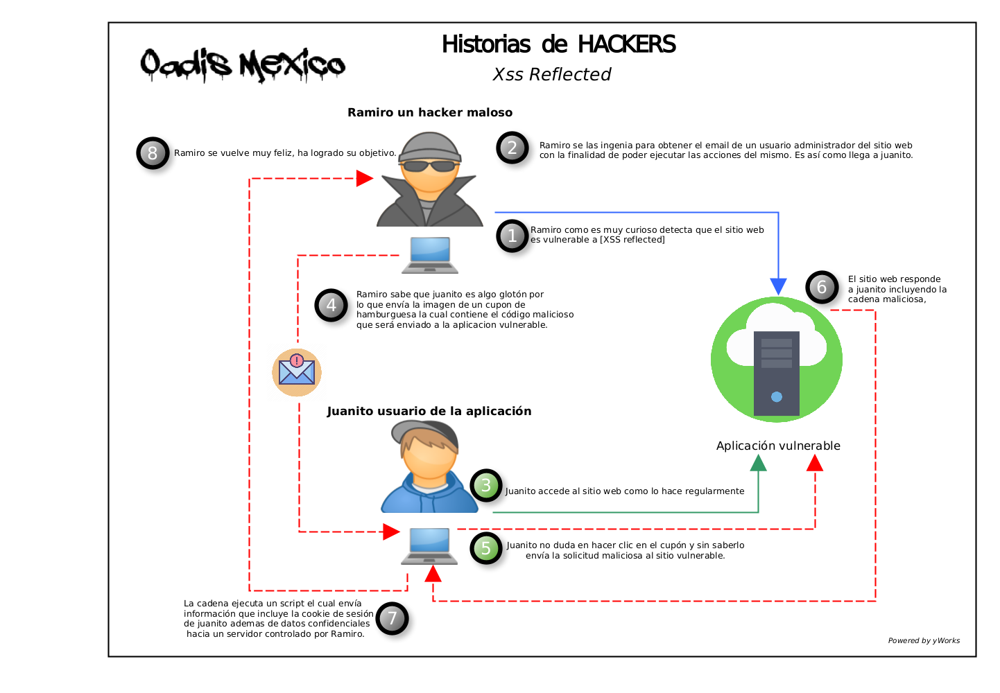

# Xss Reflected                

## ¿Que es Xss Reflected?

Xss es una vulnerabilidad presente comúnmente en aplicaciones web la cual permitirá inyectar al (OUTPUT) ó a la salida de datos de la aplicación sentencias maliciosas que se reflejan o se ejecutan en el navegador de la víctima, las cuales aprovechando la confianza de la sesión que se ejecuta en el momento permitirá realizar acciones que pueden comprometer al usuario afectado. Comúnmente para la explotación de estas vulnerabilidades los atacantes suelen enviar enlaces maliciosos al usuario autenticado o dueño legítimo de la sesión para que lo ejecute con la intención de: robar cookies, robar sesiones, redireccionar a sitios controlados por el mismo atacante, modificar la vista o la estructura del sitio web, realizar acciones en nombre del usuario legítimo para dañar u obtener algún beneficio, entre algunas otras cosas.Desde la perspectiva del navegador, estas sentencias maliciosas son ejecutadas desde el sitio web por lo que el navegador lo asume como legítimo.

>Resumidamente XSS reflected implica que la carga útil maliciosa como dato de entrada se refleja, es decir, el servidor web recibe la solicitud y la misma solicitud la incluye como parte de la respuesta enviada al cliente/usuario.

La imagen siguiente muesta un ejemplo de explotacion de esta vulnerabilidad



## Conceptualización de la vulnerabilidad en código.

*Se muestra un ejemplo de código que es vulnerable a Xss reflected.*

```java
1  // Pseudocode for  Search JSP webpage
2  <c:when test="${f:h(allRecordCount) != 0}">
3  <jsp:include page="searchResults.jsp"/>
4  </c:when>
5  <c:otherwise>
6    <h4> No results found for: </h4>
7    <p><em><strong><%= request.getParameter("search") %></strong></em></p>
8  </c:otherwise>
```

1. En la línea 2 del fragmento de código, la página web valida si existen resultados de la búsqueda de un usuario, "c: when" se nombra al tag condicional para verificar si el servidor devolvió los resultados de la búsqueda, resultados que posteriormente son formateados y representados en el tag "searchResults.jsp". Esto se percibe en la línea 3.  
2. Posteriormente si no se encuentran resultados coincidentes con los datos proporcionados por el usuario se pasa al fragmento de código dentro del tag "c: otherwise" que inicia en la línea 5, este mostrará el marcado HTML dentro de las líneas 6 y 7, las cuales muestran el mensaje "No results found for:" seguido de la cadena de búsqueda proporcionada por el usuario, esto se muestra en la línea 7.  
3. Para representar el mensaje de error "No results found for:"  seguido de la cadena ingresada como búsqueda, se llama al método "request.getParameter()" para extraer el parámetro de búsqueda insertado por el usuario, que posteriormente se representa directamente como una expresión JSP. Línea 7.  
4. Desafortunadamente, en el ejemplo JSP no escapa los valores, por lo que si el parámetro "search" contenía datos con formato HTML, Java simplemente representará esta cadena sin escapar o codificar primero, por lo cual, cuando se muestra el mensaje "No results found for:", la cadena de datos HTML insertada el campo de búsqueda también se representará, permitiendo así la inyección de código en el contexto del navegador del usuario.  

## Impacto de esta vulnerabilidad.

*La tabla siguiente muestra el impacto que puede ocasionar esta vulnerabilidad tomando como referencia la triada de seguridad.*

<table style="text-align:center; float:center;">
<thead>
<tr>
  <th bgcolor="007892" style="color:#f7f7f7;">Impacto-Vulnerabilidad</th>
  <th bgcolor="007892" style="color:#f7f7f7;">Confidencialidad</th>
  <th bgcolor="007892" style="color:#f7f7f7;">Integridad</th>
  <th bgcolor="007892" style="color:#f7f7f7;">Disponibilidad</th>
</tr>
</thead>
<tbody>
<tr>
  <td bgcolor="7d5a5a" style="color:#f7f7f7;" align="center">Lectura de datos</td>
  <td bgcolor="d8345f" style="color:#f7f7f7;" align="center">Aplica</td>
  <td></td>
  <td></td>
</tr>
<tr>
  <td bgcolor="7d5a5a" style="color:#f7f7f7;" align="center">Obtención de privilegios</td>
  <td bgcolor="d8345f" style="color:#f7f7f7;" align="center">Aplica</td>
  <td></td>
  <td></td>
</tr>
<tr>
  <td bgcolor="7d5a5a" style="color:#f7f7f7;" align="center">Ejecución no autorizada de comandos</td>
  <td bgcolor="d8345f" style="color:#f7f7f7;" align="center">Aplica</td>
  <td bgcolor="d8345f" style="color:#f7f7f7;" align="center">Aplica</td>
  <td bgcolor="d8345f" style="color:#f7f7f7;" align="center">Aplica</td>
</tr>
<tr>
  <td bgcolor="7d5a5a" style="color:#f7f7f7;" align="center">Modificación de datos</td>
  <td></td>
  <td bgcolor="d8345f" style="color:#f7f7f7;" align="center">Aplica</td>
  <td></td>
</tr>
</tbody>
</table>

## Conceptualización de la remediación de la vulnerabilidad en código.

```java
1  // Pseudocode for remediation Search JSP webpage
2  <c:when test="${f:h(allRecordCount) != 0}">
3  <jsp:include page="searchResults.jsp"/>
4  </c:when>
5  <c:otherwise>
6    <h4>No results found for: </h4>
7      <p><em><strong><c:out value="${<%= request.getParameter("search") %>}"/></strong></em></p>
8  //    <p><em><strong><%= request.getParameter("search") %></strong></em></p>
9 </c:otherwise>
```

Para realizar la remediación adecuada a esta vulnerabilidad dentro del ejemplo presentado anteriormente vamos a hacer uso del tag "c:out" en la línea 7, esta etiqueta nos ayudará a controlar los datos proporcionados por los usuarios ya que escapará y codificará de manera automática los caracteres HTML dentro del marcado mostrado al usuario, incluidos los caracteres "<" ">" ",", por lo cual esto evitará la inyección de código malicioso. 

## ¿Que elementos puedo utilizar para reforzar la seguridad ante esta vulnerabilidad o en el momento en que este desarrollando una nueva aplicación?

1. Uso del atributo HTTPOnly en las cookies.
   Este indicador evita que código JS acceda al contenido de la cookie, lo cual evita que las cookies sean obtenidas a través de la explotación de esta vulnerabilidad.
2. Uso del encabezado de respuesta http Content-Security-Policy. 
   Este funciona baja el principio de white list, este encabezado restringe las fuentes desde las cuales se pueden cargar scripts y datos en todo sitio web, si un código malicioso se introduce en el código HTML sin ser reconocido dentro de la whitelist y este intenta cargar datos externos, el navegador del usuario lo rechazará.
3. Uso del encabezado HTTP X-XSS-Protection.
   Este encabezado evita que los navegadores carguen una página si detectan la explotación de Reflected XSS.
4. Uso de encabezados de respuesta apropiados. 
   Establecer la cabecera X-Content-Type-Options nos apoyará en asegurar que los navegadores  no carguen hojas de estilo, JavaScript o un Myme-type no definido o inadecuado. Esto reduce el riesgo de un ataque de Xss o de confusión de Myme-type.

### Proximas actividades por incluír dentro de este artículo.

<div>


<p>
- Desarrollo de aplicación dummie vulnerable a xss reflected.
<br>
- Walkthrough para explotación de vulnerabilidad.
<br>
- Intrusion test para validar que la solución de remediación propuesta es adecuada.
<br>
- Controles compensatorios en caso de no poder remediar a nivel código.  
</p>
<h4>Referencias</h4>
<p>
https://capec.mitre.org/data/definitions/591.html
<br>   
https://owasp.org/www-community/attacks/xss/    
<br>
https://www.veracode.com/security/xss
</p>

</div>

